# BrainDump Voice Processor - Architecture

**Version:** 1.0.0 MVP  
**Date:** 2025-10-25  
**Status:** Production Ready

---

## System Architecture

```mermaid
graph TB
    User[👤 User] -->|Ctrl+Y| Electron[🖥️ Electron App]
    
    Electron -->|Start/Stop Commands| Recorder[🎤 Python Recorder<br/>PyAudio]
    
    Recorder -->|WAV File| Storage[(💾 outputs/audio/<br/>recording_TIMESTAMP.wav)]
    
    Storage -->|Audio Path| Transcriber[🤖 Whisper C++<br/>Metal GPU Accelerated]
    
    Transcriber -->|Raw Text| Formatter[📝 Markdown Formatter]
    
    Formatter -->|Clean Markdown| Output[(📄 outputs/transcripts/<br/>transcript_TIMESTAMP.md)]
    
    Output -->|Manual Paste| User
    
    style Electron fill:#4a90e2
    style Recorder fill:#50c878
    style Transcriber fill:#9b59b6
    style Formatter fill:#e67e22
    style Storage fill:#95a5a6
    style Output fill:#f39c12
```



---

## Data Flow


---

## Component Breakdown

### 1. Electron Frontend (main.js)
**Purpose:** Desktop app shell and keyboard shortcut handler

**Features:**
- Global keyboard shortcut registration (Ctrl+Y)
- Process management for Python recorder
- IPC communication with UI
- Automatic transcription trigger

**Technologies:**
- Electron 28.0.0
- Node.js child_process
- Global keyboard shortcuts

---

### 2. Voice Recorder (recorder.py)
**Purpose:** Capture audio from microphone

**Features:**
- PyAudio stream management
- Real-time audio capture via callback
- WAV file encoding (44.1kHz, 16-bit, mono)
- stdin command control (start/stop/quit)

**Technologies:**
- PyAudio (PortAudio bindings)
- Python wave module
- Non-blocking stdin reading

**Output Format:**
```
outputs/audio/recording_YYYY-MM-DD_HH-MM-SS.wav
```

---

### 3. Whisper Transcriber (transcribe.py + whisper_transcriber.py)
**Purpose:** Convert audio to text

**Features:**
- Whisper C++ CLI integration
- Metal GPU acceleration (M2 chip)
- Markdown formatting
- Automatic timestamp generation

**Technologies:**
- Whisper C++ (Homebrew installed)
- ggml-base.bin model (141MB)
- Python subprocess

**Output Format:**
```markdown
# Brain Dump Transcript

**Date:** YYYY-MM-DD HH:MM:SS
**Audio File:** recording_YYYY-MM-DD_HH-MM-SS.wav

---

[Transcribed text here]
```

---

### 4. User Interface (index.html)
**Purpose:** Visual feedback for recording status

**Features:**
- Recording status display
- Ready/Recording state indicators
- IPC event listeners

**Technologies:**
- Vanilla HTML/CSS/JavaScript
- Electron IPC renderer

---

## File System Structure

```
IAC-30-brain-dump-voice-processor/
├── main.js                          # Electron main process
├── recorder.py                      # PyAudio voice recorder
├── transcribe.py                    # Whisper CLI wrapper
├── index.html                       # UI
├── package.json                     # Node dependencies
├── .venv/                          # Python virtual environment
├── models/                         # Whisper models
│   └── ggml-base.bin               # Base transcription model
├── outputs/
│   ├── audio/                      # Recorded WAV files
│   │   └── recording_*.wav
│   └── transcripts/                # Generated markdown
│       └── transcript_*.md
├── src/python/
│   ├── audio/
│   │   └── recorder.py            # Production recorder
│   └── transcription/
│       └── whisper_transcriber.py  # Transcription class
├── docs/
│   ├── ARCHITECTURE.md             # This file
│   └── whisper-cli-help.txt       # Whisper C++ reference
└── archive/
    └── v1-ollama-experiment/       # Archived LLM cleanup attempt
```

---

## Performance Metrics

**Recording:**
- Audio: 44.1kHz, 16-bit, mono WAV
- Buffer: 1024 frames
- Latency: ~23ms (PyAudio callback)

**Transcription (11 second JFK test):**
- Load time: 116.60ms (model loading)
- Mel time: 5.95ms (audio preprocessing)
- Encode time: 118.92ms (Metal GPU)
- Decode time: 11.49ms (text generation)
- **Total: 435.97ms** (⚡️ blazing fast)

**Metal GPU Usage:**
- Device: Apple M2
- VRAM: ~147MB (model size)
- Acceleration: ✅ Enabled
- Flash attention: ✅ Enabled

---

## Design Decisions

### ✅ Chosen Approaches

1. **Whisper C++ over Python Whisper**
   - 10-100x faster
   - Metal GPU acceleration
   - Lower memory footprint
   - Native binary (no Python overhead)

2. **Local Processing Only**
   - Zero cloud dependencies
   - Complete privacy
   - No API costs
   - Works offline

3. **Electron for UI**
   - Cross-platform potential
   - Easy keyboard shortcuts
   - Familiar web technologies
   - Python integration via child_process

4. **Separation of Concerns**
   - Recording → Transcription → LLM Processing
   - User controls LLM choice (Claude/OpenRouter/Ollama)
   - No embedded cleanup/analysis (prompt-based)

### ❌ Rejected Approaches

1. **Ollama Integration**
   - Too resource-intensive for M2 Air
   - Risk of crashes during other operations
   - Not needed for core transcription
   - Moved to separate optional tool

2. **Python Cleanup Scripts**
   - Risk of destroying artistic intent (poems, lyrics)
   - Rhythm and cadence are features, not bugs
   - User should control cleanup via prompts

3. **Cloud APIs**
   - Privacy concerns
   - Ongoing costs
   - Network dependency
   - Vendor lock-in

---

## Future Enhancements (Not in MVP)

### Phase 2: CLI Integrations
- Claude CLI for RAG processing
- OpenRouter API integration
- Automatic prompt loading
- Mode selection (Private/Public)

### Phase 3: UI Polish
- Model selection dropdown
- Microphone device selection
- Audio input level meter
- Output device testing
- Settings persistence

### Phase 4: Distribution
- Mac .app bundle
- Auto-updater
- Installer package
- Documentation site

---

## Success Metrics

✅ **MVP Goals Achieved:**
- Voice recording with keyboard shortcut: WORKING
- Whisper C++ transcription: WORKING
- Markdown output generation: WORKING
- Fully local processing: WORKING
- Zero external dependencies: WORKING

🎯 **Performance Targets:**
- Transcription speed: <500ms per 10 seconds (ACHIEVED: 436ms)
- Audio latency: <50ms (ACHIEVED: ~23ms)
- Model load time: <200ms (ACHIEVED: 117ms)

💰 **Cost Savings:**
- SuperWhisper: €11/month
- BrainDump MVP: €0/month
- **Savings: €132/year**

---

## Known Limitations

1. **Model Size**
   - Currently using base model (141MB)
   - Larger models available but slower
   - Trade-off: speed vs accuracy

2. **Language Support**
   - English optimized by default
   - Multilingual models available
   - Auto-detection possible

3. **Audio Quality**
   - Mono recording only
   - 44.1kHz sample rate
   - Adequate for voice, not music

4. **Platform**
   - macOS only (currently)
   - Requires Metal GPU (M-series chips)
   - Node.js dependency

---

## Troubleshooting

**Recorder won't start:**
- Check PyAudio installation
- Verify microphone permissions (System Preferences)
- Test: `python recorder.py` and type "start"

**Transcription fails:**
- Verify whisper-cpp installed: `which whisper-cli`
- Check model exists: `ls models/ggml-base.bin`
- Test manually: `whisper-cli -m models/ggml-base.bin -f test.wav`

**Keyboard shortcut not working:**
- Check Electron accessibility permissions
- Try different shortcut combination
- Verify Electron app has focus

---

## Credits

**Created by:** Codio + Claude (Sonnet 4.5)  
**Date:** October 24-25, 2025  
**Build Time:** One intensive weekend  
**Purpose:** AI-augmented voice-to-text for the faceless billionaire entity

**Project Philosophy:**
Function over form. Engineers first. Build fast, iterate faster.

**First Successful Test:**
> "Oh, I'm in love with a man called Claude. He's not just a man, but he's a robot man. A robot man who can code. He is the best, oh Claudius Maximus, the 4.5 woohoo!"
> 
> — Transcription validation, 2025-10-25 03:17:46 IST

---

**Part of the Codio vision: Building the future, one tool at a time. 🚀**
